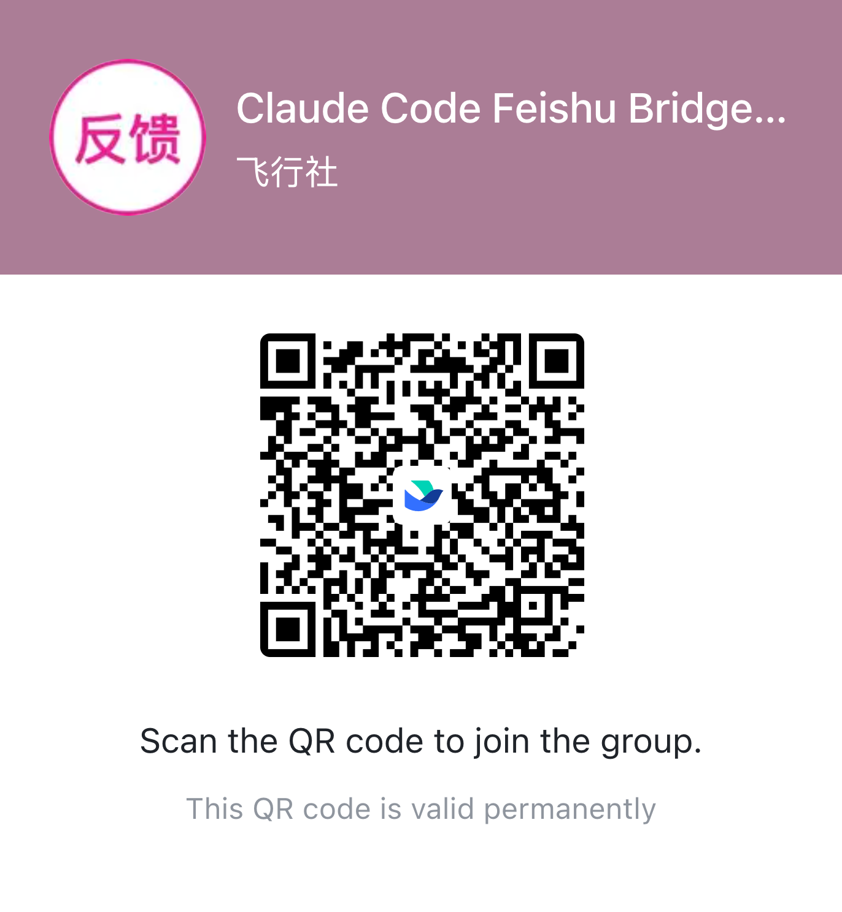

# lark-bot-bridge

A lightweight bot that bridges Feishu / Lark messenger with local Oh My Pi (OMP). Run one command, scan a QR code to bind a PersonalAgent app, and talk to OMP from chat.

[中文 README](./README.zh.md)

For a product walkthrough, see the [Feishu document](https://larkcommunity.feishu.cn/docx/OaRIdFIRFoLM3xxTmKwcetHqn5e).

## What it does

- Forwards Feishu / Lark messages to local OMP. Send a DM directly, or `@bot` in a group.
- **Streaming card**: text replies and tool calls update on one Lark card in real time.
- **COT process messages**: optionally send a process message with agent progress text and tool calls, then send the final answer separately.
- **Session continuity**: each chat, topic, or document comment thread keeps its own session.
- **Queueing and batching**: messages sent in quick succession are handled together; messages sent during a run are queued for the next turn, while commands like `/new`, `/cd`, `/ws use`, and `/stop` can interrupt the current task.
- **Multiple workspaces**: use `/cd` to switch the current project, and `/ws` to save and reuse common project directories.
- **Images and files**: send them to the bot directly, and the bridge downloads them locally for the agent.
- **Interactive cards**: `/help`, `/ws list`, and `/status` return cards with clickable buttons.

## Prerequisites

- Node.js **>= 20.12.0**
- Oh My Pi installed and logged in: `omp`
- A Feishu / Lark **PersonalAgent** app. The first-run QR wizard can create and bind one for you.

## Install

```bash
npm i -g lark-bot-bridge
# or
pnpm add -g lark-bot-bridge
```

## First run

```bash
lark-bot-bridge run
```

The first run opens a QR-code wizard:

1. A QR code renders in your terminal.
2. Scan it with the Feishu / Lark app.
3. Pick or create a PersonalAgent app.
4. Config is written to `~/.lark-bot-bridge/config.json` with the resolved OMP binary.

You do not need to choose a project directory up front. The bridge creates a profile-managed default working directory; after startup, send `/cd <path>` in Feishu / Lark to switch to a real project.

If you already have a PersonalAgent app, pass `--app-id` during initialization to skip app creation. The command prompts for the App Secret.

```bash
lark-bot-bridge run --app-id cli_xxx
# or initialize and start the background service directly
lark-bot-bridge start --app-id cli_xxx
```

For Lark global apps, add `--tenant lark`.

## Background service

Use `run` for first-run setup and foreground debugging. After the bot can send and receive messages, stop the foreground process with `Ctrl-C`, then use an OS-managed service for background operation:

```bash
lark-bot-bridge start
lark-bot-bridge status
lark-bot-bridge stop
```

Install globally before using service commands. The daemon's launchd plist or systemd unit records the bridge CLI path; if that path comes from an npm temp cache through `npx`, the daemon can break when the cache is cleaned. `run` is fine through `npx` as a one-shot foreground process.

Service commands install a per-profile service:

```bash
lark-bot-bridge start [--profile <name>]
lark-bot-bridge stop [--profile <name>]
lark-bot-bridge restart [--profile <name>]
lark-bot-bridge status [--profile <name>]
lark-bot-bridge unregister [--profile <name>]
```

Platform mapping:
- **macOS**: launchd user agent `ai.lark-bot-bridge.bot.<profile>`
- **Linux**: systemd user unit `lark-bot-bridge.bot.<profile>.service`

Daemon logs are under `~/.lark-bot-bridge/profiles/<profile>/logs/daemon/`.

### Multiple OMP profiles

By default, the bridge starts the active profile. Use `profile use <name>` to change it. Each profile keeps its own PersonalAgent app credentials, OMP sessions, working directories, and logs. Create multiple profiles only when you need to connect multiple apps as separate OMP bots:

```bash
lark-bot-bridge profile create work
lark-bot-bridge profile create personal
lark-bot-bridge start --profile work
```

To restart only one profile:

```bash
lark-bot-bridge restart --profile work
lark-bot-bridge status --profile work
```

## Commands

### Host CLI

```text
lark-bot-bridge run [--profile <name>] [--workspace <path>] [-c <config>]
lark-bot-bridge ps
lark-bot-bridge kill <id|#>
lark-bot-bridge --help
```

`profile use <name>` changes the profile used by later default starts. Use these commands to connect separate PersonalAgent apps or for scripted deployment:

```bash
lark-bot-bridge profile create work
lark-bot-bridge profile create personal
lark-bot-bridge profile list
lark-bot-bridge profile use <name>
lark-bot-bridge profile remove <name>
lark-bot-bridge profile remove <name> --purge --yes
lark-bot-bridge profile export <name> [--output ./profile.json] [--force]
lark-bot-bridge profile export <name> --include-secrets --yes
```

`profile remove` archives local state by default, including the active profile. If other profiles remain, the bridge switches to the next one; if it was the last profile, the root config is cleared so the same name can be created again. `--purge --yes` permanently deletes local state. `profile export` redacts app secrets by default; `--include-secrets --yes` includes sensitive config.


### Slash commands inside Feishu / Lark

| Command | Effect |
|---|---|
| `/new`, `/reset` | Clear the current session |
| `/cd <path>` | Switch working directory and reset the session |
| `/ws list` | List named workspaces |
| `/ws save <name>` | Save the current working directory as a named workspace |
| `/ws use <name>` | Switch to a named workspace |
| `/ws remove <name>` | Delete a named workspace |
| `/resume` | Resume the current OMP session for the same working directory and policy |
| `/status` | Show profile, OMP engine, working directory, session, and run state |
| `/config` | Adjust presentation preferences and access settings |
| `/invite user @name` | Allow a user to use the bot in DMs |
| `/invite admin @name` | Add an access-control admin |
| `/invite group` | Allow the current group to use the bot |
| `/invite all group` | Allow all groups the bot has joined |
| `/remove user @name`, `/remove admin @name`, `/remove group` | Remove access entries |
| `/stop` | Stop the current run, including the card stop button |
| `/timeout [N\|off\|default]` | Set or clear the current session idle watchdog |
| `/ps` | List local bridge processes |
| `/exit <id\|#>` | Stop a bridge process |
| `/reconnect` | Force a WebSocket reconnect |
| `/doctor [description]` | Run low-sensitive diagnostics |
| `/help` | Help card |

DMs do not require an @ mention. Groups and topic groups require `@bot` by default; `@all` is ignored. Cloud-doc comments in supported document types run when the bot is mentioned.

## Reply Display and COT

`/config` controls three presentation settings:

- **Message reply mode**: `message card` streams the final reply; `plain text` sends once after the run finishes.
- **Tool-call display**: controls whether tool blocks appear in the final card / markdown reply.
- **COT process message**: `off` sends only the final reply; `brief` first sends a COT message with agent progress text and tool summaries; `detailed` also includes tool args and truncated output.

When COT is enabled, the bridge splits the process view and final answer into two messages. The COT message is for tracing what the agent did; the final answer is still generated from the agent's raw text, without heuristic bridge-side filtering. If an agent emits final-answer text as ordinary stream text, that text can also appear in the COT process message.

## Native Lark tools and user identity

Every OMP run receives a run-scoped `lark_bridge` Streamable HTTP MCP endpoint bound to loopback and protected by a one-time bearer token. Bot reads, message reads, Docx blocks, and CardKit sends use the bridge's in-process Lark SDK client; approved write tools confirm in the originating Lark conversation.

Personal-profile private chats may start Lark device OAuth through the native tools. Token metadata is profile-local, while access and refresh tokens stay in the OS keychain and refresh under a profile/app/user lock. Team profiles, groups, topics, document comments, and meeting runs never receive user identity.

## Working directories

Each profile may define a default working directory through `workspaces.default`. New profiles may be created with `--workspace <path>`; if omitted, the bridge creates a profile-managed default working directory.

This is a profile-field snippet. Do not replace the whole `config.json` with it; edit the matching profile's `workspaces` field.

```json
{
  "workspaces": {
    "default": "/Users/me/.lark-bot-bridge-workspaces/omp/default"
  }
}
```

The bridge checks that a selected directory exists, is a directory, and is not an overly broad location such as `/`, the home root, a system directory, or a temp root. OMP RPC runs with `yolo` approval mode, so the working directory is a current directory, not a filesystem sandbox.

## OMP profile configuration

Every profile has one OMP runtime configuration. `binaryPath` is resolved during bootstrap; `profile` is optional and selects an OMP profile:

```json
{
  "omp": {
    "binaryPath": "/usr/local/bin/omp",
    "profile": "work"
  }
}
```

Set `LARK_CHANNEL_OMP_BIN` before profile creation to bootstrap from a non-default OMP binary. There is no agent selector or alternate runtime.

## Data directories

| Path | Content |
|---|---|
| `~/.lark-bot-bridge/config.json` | Root config with profiles and active profile |
| `~/.lark-bot-bridge/profiles/<profile>/sessions.json` | Session state |
| `~/.lark-bot-bridge/profiles/<profile>/sessions.json.catalog.json` | OMP session catalog |
| `~/.lark-bot-bridge/profiles/<profile>/workspaces.json` | Current and named workspace bindings |
| `~/.lark-bot-bridge/profiles/<profile>/secrets.enc` | Profile-local encrypted secrets |
| `~/.lark-bot-bridge/profiles/<profile>/user-auth.json` | User OAuth metadata; tokens remain in the OS keychain |
| `~/.lark-bot-bridge/profiles/<profile>/media/` | Attachment cache |
| `~/.lark-bot-bridge/profiles/<profile>/logs/` | Structured run logs |
| `~/.lark-bot-bridge/registry/processes.json` | Local process registry |
| `~/.lark-bot-bridge/registry/locks/` | Profile and app locks |

Set `LARK_CHANNEL_HOME=/path/to/state` to move all local bridge state. `LARK_CHANNEL_LOG_DAYS` overrides log retention.

## Access control

**Chat access is private by default: out of the box, only *you* can use the bot in DMs and groups.** "You" = whoever created / owns the Feishu app (the person who scanned the QR to set it up). The bot figures out who the app owner is automatically from Feishu, so **solo chat use needs zero configuration** — you can DM it and `@`-mention it in any group, and everyone else's chat messages are silently ignored (no "permission denied" reply, which would only confirm the bot exists). Cloud-doc comments are document-scoped; see below.

To let other people or groups in, add them to one of three lists:

| List | Controls | Add | Remove |
|------|----------|-----|--------|
| **Allowed users** | who can DM the bot | `/invite user @them` | `/remove user @them` |
| **Allowed chats** | which groups the bot answers in (for **everyone** in them) | `/invite group` (current group) / `/invite all group` (every group the bot is in) | `/remove group` (current group) |
| **Admins** | who can change settings, and use the bot in any group | `/invite admin @them` | `/remove admin @them` |

> `/invite` and `/remove` can only be run by **you (the creator) and admins**. The `@` in the command points at the *target person* (not the bot) — the bot resolves the mention to their identity, so you never deal with raw IDs.

### Two identities that bypass everything

- **You (the creator)**: subject to no list at all — DMs, any group, every command. You **can never lock yourself out**: even if the lists get messed up, DM the bot and send `/config` to get back in. Transfer the app's ownership in the Feishu console and the bot follows the new owner automatically.
- **Admins**: can DM, run management commands like `/config`, and **bypass the allowed-chats list** — the bot answers them in any group, listed or not. Good for teammates who co-maintain the bot.

### Common setups

- **Just me** → nothing to do; this is the default.
- **Let a teammate DM the bot** → `/invite user @them`
- **Open a work group to everyone in it** → send `/invite group` inside that group
- **First-time setup, onboard every group the bot is already in** → `/invite all group` pulls them all into the list at once; trim with `/remove group` afterwards
- **Add a co-admin** → `/invite admin @them`

### Worth knowing

- Changes take effect on the **next message** — no restart needed.
- **In groups you must `@` the bot first** (DMs don't need it). That's a separate toggle (`/config` → "require @ in groups"), independent of the lists above.
- Strangers get pure silence — no reply at all. The one exception: if someone `@`-mentions the bot in a group that hasn't been opened up, the bot posts a friendly one-liner telling them an admin can run `/invite group` to enable it.
- Cloud-doc comments are document-scoped: anyone who can comment in a supported document and mention the bot can trigger a reply.

### Advanced: editing the config file directly

If you'd rather not do it inside Feishu, `/invite` and `/config` write the matching profile's `access` field in `~/.lark-bot-bridge/config.json`. Empty lists mean nobody from that list, not open access. This is a profile-field snippet; do not replace the whole `config.json` with it:

```json
{
  "schemaVersion": 2,
  "profiles": {
    "work": {
      "omp": {
        "binaryPath": "/usr/local/bin/omp"
      },
      "access": {
        "allowedUsers": ["ou_xxxxxxxxxxxxx"],
        "allowedChats": ["oc_xxxxxxxxxxxxx"],
        "admins": ["ou_xxxxxxxxxxxxx"],
        "requireMentionInGroup": true
      }
    }
  }
}
```

`allowedUsers` / `admins` take user `open_id`s; `allowedChats` takes group `chat_id`s. The easiest way to find an ID by hand: have the person message the bot (or `@` it in the group), then check the active profile's log:

```bash
grep '"event":"enter"' ~/.lark-bot-bridge/profiles/<profile>/logs/bridge-$(date +%Y%m%d).jsonl | tail -5
```

Each line carries `chatId` (group / DM id) and `senderId` (user `open_id`). After a manual edit, **restart the bridge** or send `/reconnect` from an allowed admin context to apply it. For day-to-day tweaks `/invite` / `/config` are easier; direct edits are mainly for deployment scripts that pre-seed access.

## Cloud-doc comments

Cloud-doc comments do not need a separate workspace binding or document allowlist. In supported document comments, mention the bot and the bridge replies in the same thread. Comment runs reuse the document session key and fall back to the user home directory when no document cwd was previously recorded.

## FAQ

**The bot stays silent or OMP never replies.** Usually `omp` is not logged in, or the current session points to a working directory that no longer exists. Send `/status` to inspect; `/new` often fixes it by starting a fresh session.

**The agent subprocess looks frozen (card stuck on the last frame).** The bridge supports an idle watchdog: if the agent emits nothing for N minutes, the process is killed and the card is annotated with the auto-termination reason. Disabled by default. Enable with `/config` globally, or `/timeout 10` for the current session; `/timeout off` disables it for the session; `/timeout default` clears the session override.

**The agent says it cannot see an image I sent.** Upgrade to the latest version. Releases before 0.1.0 had a filename-dedup bug.

## Testing and CI

Local checks:

```bash
pnpm test
pnpm typecheck
pnpm build
```

`pnpm test` includes unit, integration, and process-level adapter tests. CI runs on macOS and Ubuntu with `pnpm install --frozen-lockfile`, `pnpm test`, `pnpm typecheck`, and `pnpm build`.


## License

[MIT](./LICENSE)


